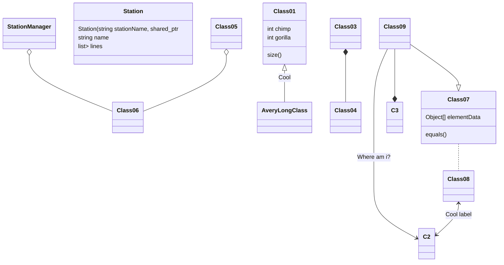

# 项目设计
注意：以下异常主要考虑输入引起，罗列备忘。
## 输入输出设计
输入采用读取文件的方法，文件格式采用json格式，解析使用[nlohmann/json](https://github.com/nlohmann/json)开源库。使用json格式的原因的格式简单，键值对的方式便于以后扩展，当前格式样例如下，其意自明：
```js
[
    {
        "name":"1号线",
        "stations":["苹果园","古城"]
    },
    {
        "name":"2号线",
        "stations":["积水潭","鼓楼大街"]
    }
]
```
输出格式固定见题目要求。
###异常情况
1. 文件不存在
1. 格式解析错误

##设计思路
### 任务1
比较简单建立一个线路（line）的list，每个线路又是一个站点（station）的列表即可，遍历线路列表找到找到对应线路，输出即可
#### 异常情况
1.线路找不到

### 任务2
原理上采用广度优先遍历，首先找到终点站的搜索路径就是最短路径。
注意地铁线路实际存在正反两条，反向路径输入文件中不包括，需要自动产生。
生成一个基于站点信息，站点信息包括下一站，文本化描述如下。
```
{
    station:'复兴门'，
    next:[
        {station: '西单'    , line:'1号线', dir:0},
        {station: '南礼士路' , line:'1号线', dir:1},
        {station: '阜成门'  , line:'2号线' , dir:0},
        {station: '长椿街'  , line:'2号线' , dir:1},
    ]
}
```
对这样一个数据结构进行广度优先遍历即可。
#### 异常情况
1.站点找不到

## 记录
完成以上设计耗时2个小时。

## 算法设计
主要思路是构建一个以station为主的图，图的边是线路名，在图中采用广度优先得到从起点到终点的路径即可，注意在一个结点搜索下一结点时需要考虑不换乘，即优先保持上一线路。还有不能重复加入路径的节点，避免死循环。

